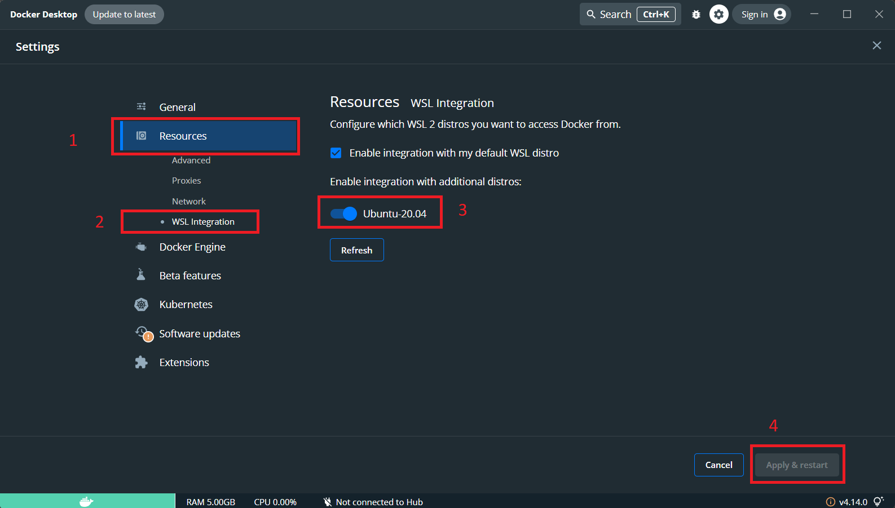
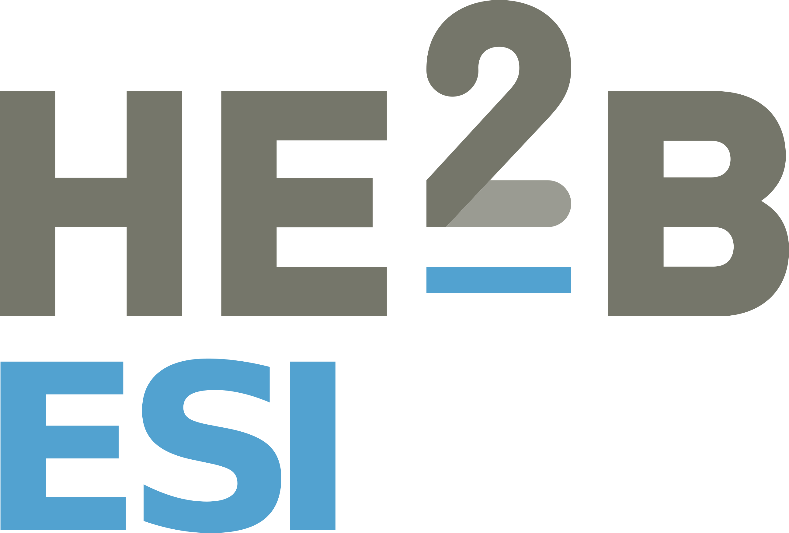

# ESI Attendance
# Docker initialisation et déploiement : 

## Si vous êtes sur windows :
1. Installer une distribution WSL Ubuntu-20.04
2. Ouvrer votre distribution WSL Ubuntu-20.04 (apt installer)
3. Aller dans les paramètres docker et activer ceci 
4. Cloner le répertoire git
5. Exécutez `./installNecessaryPackage.sh`
6. Exécutez ensuite `./init.sh`


## Si vous êtes sur Linux : 
1. Cloner le répertoire git 
2. Exécutez `./installNecessaryPackage.sh`
3. Exécutez `./init.sh`
---





---


# Anciennement : 

This project consist of realizing short *stories* dicted by some fictitious client. These *stories*
will be realized in PHP using the **Laravel** framework.

- *Deployment url:* [esi-attendance](https://protected-escarpment-92161.herokuapp.com/)

## Story 1

```
En tant qu’enseignant je souhaite consulter via un browser la liste des étudiants.
Le but est de prendre les présences lorsque mon cours commence.

## Assertions ##
Lorsque je consulte la liste je vois tous les étudiants triés par matricule.
```

## Story 2

```
En tant qu’enseignant je souhaite ajouter ou supprimer un étudiant de la liste
afin que celle-ci soit à jour.

## Assertions ##
Lorsque j'ajoute un nouvel étudiant, je vois dans la liste ce nouvel étudiant et lorsque 
je le supprime, il n'apparait plus dans la liste.
```

## Story 3

```
De plus, je souhaite consulter via un browser la 
liste des leçons prévues. Le but est de connaître l’horaire des cours donnés.

## Assertions ##
Lorsque je consulte la liste je vois toutes les leçons triées par date et heure.
```

## Story 4

```
Enfin, je souhaite prendre les présences lors d’une leçon. Le but est de connaître 
le nombre d’étudiants par leçon.

## Assertions ##
Lorsque j’ajoute une présence, je peux la consulter dans une liste des présences liée
à la leçon.
```

## Project setup

Here is the commands to setup the project:
```bash
composer install
npm install
npm run build
php artisan key:generate
php artisan migate # setup .env file before
php artisan serve
npm run dev # in separate terminal (to run Vite server)
```

## Run tests

Here is how to run the unit and feature tests using `phpunit`:
```bash
./vendor/bin/phpunit
```
To have more verbose test reports, you can instead run the `test` Artisan
command:
```bash
php artisan test
```
To run the tests for the application view, you can use `Dusk`:
```bash
composer require --dev laravel/dusk # If not already installed
php artisan dusk
```

